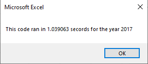
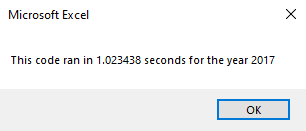
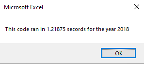
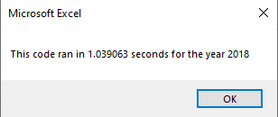
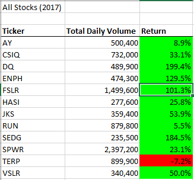
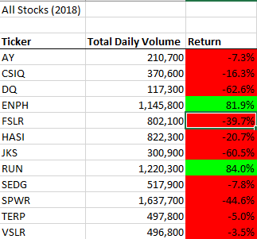

# Analyzing Stocks with VBA

## Overview of Project
This project is an attempt to compare stock perfomances between two different years.

## Results

### How We Got Here
Through VBA, we used a coded array to compare each stock ticker's own cumulitave daily volume and returns against each other.
  For j = 2 To RowCount
    
        '3 find starting price, ending price, total volume
        
               
        If Cells(j - 1, 1).Value <> ticker And Cells(j, 1) = ticker Then
            tickerStartingPrices = Cells(j, 6).Value
            
        End If
      
        
        If Cells(j + 1, 1).Value <> ticker And Cells(j, 1) = ticker Then
            tickerEndingPrices = Cells(j, 6).Value
            
        End If
        
        If Cells(j, 1).Value = ticker Then
        tickerVolumes = tickerIndex + Cells(j, 8).Value
        
        End If

     Next j
      
        
        Worksheets("All Stocks Analysis").Activate
        
    Cells(4 + i, 1).Value = ticker
    Cells(4 + i, 2).Value = tickerVolumes
    Cells(4 + i, 3).Value = tickerEndingPrices / tickerStartingPrices - 1
Within the code, there is a prompt to enter in which year the user would like to look through - allowing them to quickly grab a snapshot of any given year to see how their investments are performing. This is also useful if they are looking to diversify, since they can check on trends of unexplored stocks.

Additionally, through refactoring, I was able to shave some time off of the processing in both 2017

 

and 2018

 

### Analysis
Overall we can see that 2017

Had overall better returns than 2018

With significant losses accross all but three stock tickers.
Based on these numbers, it would be wise to bet on ENPH, RUN, or TERP. These were the most stable stocks from the dataset, though TERP was still looking at a loss. Overall, ENPH saw the greatest growth - but this dataset is not enough to gaurantee that trend.

## Summary
The largest advantage I had after refactoring was being able to come back to my code and know what I was looking at. Even with all of the notes above code, my first pass through was messy, out of order, and repetitive. Taking out redundant code, and also putting the code in a more intuitive order, was beneficial to me.
I will say that a frustrating aspect of refactoring is that you can suddenly break your code, or begin to second-guess yourself. Even with this small dataset and simple brief, I found myself trying to show more than was required. This may just be a character flaw.
With this code, our initial pass was large and clunky. Once it was refactored, it was a little easier to look at, as well as "telling the story" more cohesively.

